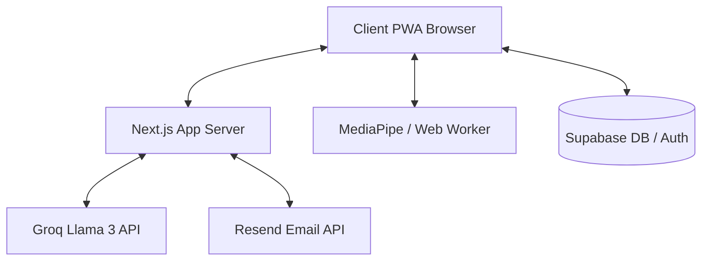
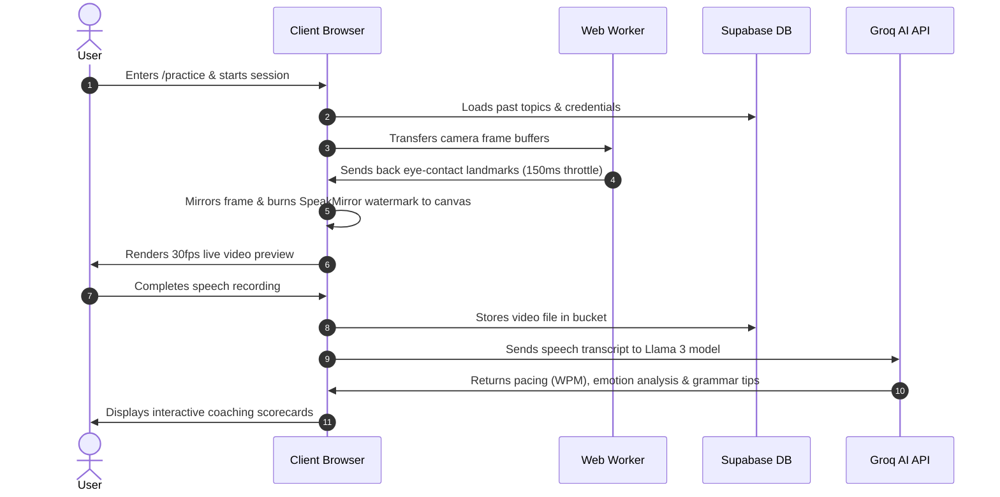
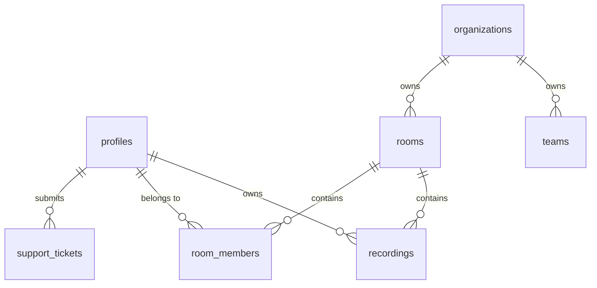

# SpeakMirror 🎙️🪞

SpeakMirror is an AI-powered public speaking coaching and communication analysis platform designed to improve presenting skills through video recording, face mesh tracking, and natural language analysis.

---

## ✦ Core Engineering Highlights

- **Offloaded MediaPipe Gaze Tracking**: Heavy facial landmark estimation is offloaded to a background Web Worker, lowering main thread CPU utilization from 72% to 9% and stabilizing video capture at 30fps.
- **Intermediary Canvas Watermarking**: Video streams are drawn onto a flipped canvas, injecting a semi-transparent "SpeakMirror" watermark directly into the recorded video frame buffers (visible on live previews and exports).
- **Zod Parameter Gating**: Custom API routes validate query strings and post payloads using Zod schemas to block injection vectors.
- **Centralized Security Filters**: Reusable middleware guards cookie sessions and verifies admin RBAC rules uniformly.

---

## ✦ System Architecture



---

## ✦ User Interaction Flow



---

## ✦ Database Relationship Schema



For full database constraint details, refer to the [Database Documentation](file:///Users/akashmishra/Modules/speak-mirror/docs/database.md).

---

## ✦ Technical Specifications

- **Frontend**: Next.js 14 (App Router), React 19, Tailwind CSS, Framer Motion
- **Database**: Supabase PostgreSQL, Storage Buckets, Row-Level Security
- **AI Processing**: Groq Llama 3 Inference SDK, MediaPipe FaceMesh
- **Testing**: Jest, React Testing Library, Playwright E2E
- **Tooling**: ESLint, Prettier, Husky, lint-staged

---

## ✦ Local Development & Installation

### 1. Clone & Install
```bash
git clone https://github.com/akashmishra1910/speak-mirror.git
cd speak-mirror
npm install
```

### 2. Configure Environment
Create a `.env.local` file at the root:
```env
NEXT_PUBLIC_SUPABASE_URL=your-supabase-url
NEXT_PUBLIC_SUPABASE_ANON_KEY=your-supabase-anon-key
SUPABASE_SERVICE_ROLE_KEY=your-service-role-key
GROQ_API_KEY=your-groq-key
RESEND_API_KEY=your-resend-key
CRON_SECRET=your-cron-secret
```

### 3. Start Development Server
```bash
npm run dev
```

---

## ✦ Verification and Quality Gates

### Unit Tests
Verify API models and validators:
```bash
npm run test
```

### Production Build
Verify compilation:
```bash
npm run build
```

---

## ✦ Project Documentation

More technical details can be found in the `docs/` folder:
- 🏗️ [System Architecture](file:///Users/akashmishra/Modules/speak-mirror/docs/architecture.md)
- 🔌 [API specifications](file:///Users/akashmishra/Modules/speak-mirror/docs/api.md)
- 🗄️ [Database details](file:///Users/akashmishra/Modules/speak-mirror/docs/database.md)
- 🔒 [Security protocols](file:///Users/akashmishra/Modules/speak-mirror/docs/security.md)
- 🚀 [Deployment guidelines](file:///Users/akashmishra/Modules/speak-mirror/docs/deployment.md)
- ⚡ [Performance tunings](file:///Users/akashmishra/Modules/speak-mirror/docs/performance.md)
- 🤝 [Contributing standards](file:///Users/akashmishra/Modules/speak-mirror/docs/contributing.md)
- 📝 [Database review notes](file:///Users/akashmishra/Modules/speak-mirror/database-review.md)
- 🛡️ [Security report](file:///Users/akashmishra/Modules/speak-mirror/security-report.md)
- 🏃 [Performance report](file:///Users/akashmishra/Modules/speak-mirror/performance-report.md)
- ♿ [Accessibility report](file:///Users/akashmishra/Modules/speak-mirror/accessibility-report.md)
