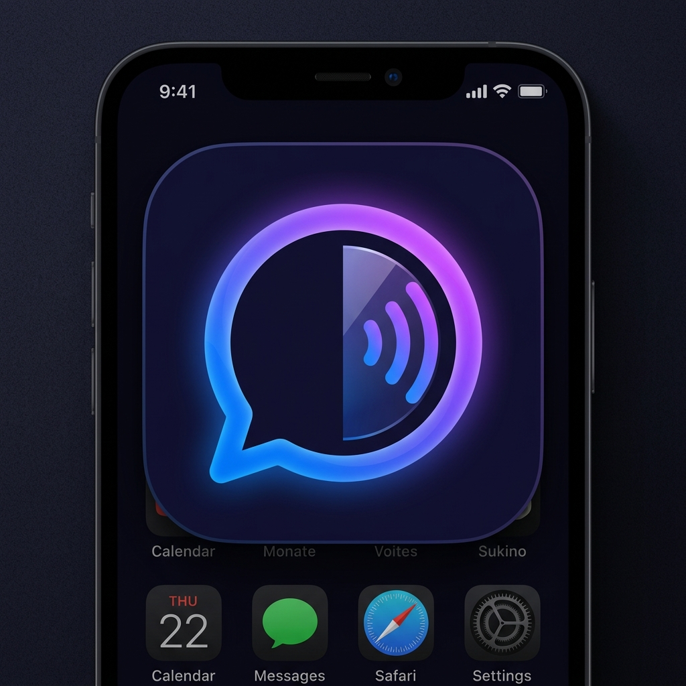

# SpeakMirror 🎙️🪞

SpeakMirror is a team-centric communication and speaking practice platform. It enables teams, classes, and groups to seamlessly practice their verbal communication skills through AI-driven daily tasks, offering instant, actionable feedback on their performance.



## ✨ Key Features

*   **Multi-Phase Daily Tasks:** A guided practice wizard featuring both spontaneous "Freeform Speech" and pronunciation-focused "Reading Aloud" modes.
*   **AI-Powered Grading Dashboard:** Instantly analyzes video submissions to provide detailed metrics on Confidence, Clarity, Pacing, and Filler Words using Groq AI.
*   **Team "Rooms" & Host Controls:** Create secure, passkey-protected rooms. Hosts can assign tasks, view team member submissions, and moderate content with secure deletion.
*   **Automated Email Notifications:** Integrates directly with Gmail SMTP via Nodemailer to instantly blast new tasks and reminders to all team members' inboxes.
*   **Progressive Web App (PWA):** Fully installable on iOS, Android, and Desktop directly from the browser for a native, full-screen app experience.
*   **Premium Glassmorphism UI:** A sleek, dark-mode design featuring dynamic animated backgrounds, deep frosted glass cards, and modern typography (`Plus Jakarta Sans`).

## 🛠️ Tech Stack

*   **Frontend:** Next.js 14 (App Router), React, Tailwind CSS, Framer Motion
*   **Backend:** Next.js Server API Routes, Supabase (PostgreSQL & Storage)
*   **Authentication:** Supabase Auth (Magic Links / Email)
*   **AI Engine:** Groq API (LLaMA 3) for speech transcript analysis
*   **Email Delivery:** Nodemailer (Gmail SMTP)
*   **PWA Setup:** `@ducanh2912/next-pwa`

## 🚀 Getting Started

### Prerequisites

You will need the following environment variables to run the application locally:

```env
NEXT_PUBLIC_SUPABASE_URL=your_supabase_url
NEXT_PUBLIC_SUPABASE_ANON_KEY=your_supabase_anon_key
SUPABASE_SERVICE_ROLE_KEY=your_supabase_service_role_key
GROQ_API_KEY=your_groq_api_key
GMAIL_USER=your_gmail_address
GMAIL_APP_PASSWORD=your_16_char_google_app_password
```

### Installation

1. Clone the repository:
   ```bash
   git clone https://github.com/yourusername/speak-mirror.git
   cd speak-mirror
   ```
2. Install dependencies:
   ```bash
   npm install
   ```
3. Run the development server:
   ```bash
   npm run dev
   ```
4. Open [http://localhost:3000](http://localhost:3000) in your browser.

## 🔒 Security & Database
SpeakMirror utilizes Supabase's **Row Level Security (RLS)** to ensure team members can only edit or view authorized data. Secure host-level actions (like deleting team submissions or accessing user emails for notifications) are strictly verified via JWT tokens and executed using the `SUPABASE_SERVICE_ROLE_KEY` in secure, private API routes.
