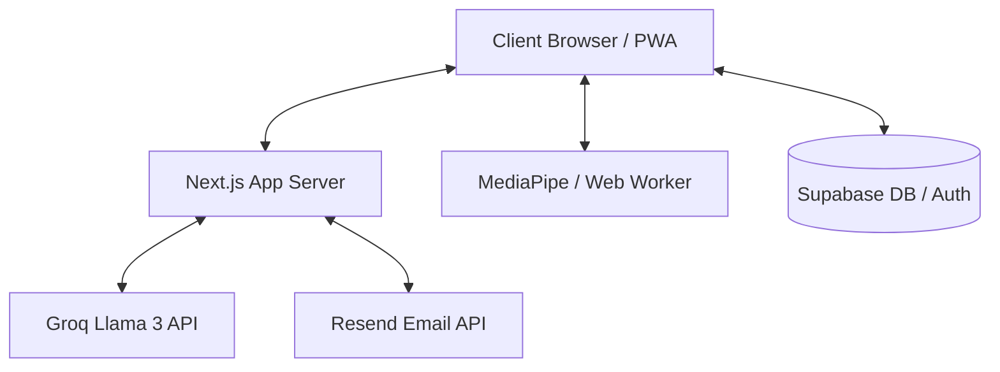

# System Architecture

This document describes the high-level system architecture of **SpeakMirror**.

## Overview

SpeakMirror is a SaaS web application designed to help public speakers, professionals, and job candidates improve their communication skills. The system captures live video and audio, processes and analyzes facial landmarks and voice metrics, and uses Groq AI for detailed speech coaching.

## Core Components

### 1. Frontend Client (Next.js & React 19)
- **App Router Layouts**: Centralized UI layout state, responsive theme switcher, and navigation.
- **PWA Service Worker**: Configured via `@ducanh2912/next-pwa` for offline capabilities and installation support.
- **Practice Canvas Intermediary**: A performance-optimized HTML5 Canvas that horizontally flips and overlays a semi-transparent SpeakMirror watermark onto live webcam frames at 30fps.
- **MediaPipe Web Worker**: Moves heavy facial landmark estimation tasks (FaceMesh) off the main JavaScript thread to avoid UI lag.

### 2. Backend API Layer (Next.js Server Actions & API Routes)
- **Standardized API Routes**: Located under `src/app/api`.
- **Centralized Authentication Hook**: Intercepts cookies and authorization headers (`src/lib/auth.ts`).
- **Zod Validation Layer**: Explicit request validation to prevent injection attacks and illegal states (`src/lib/validation.ts`).

### 3. Database & Auth (Supabase)
- **Auth Service**: Managed session state, JWT tokens, and Google OAuth integrations.
- **PostgreSQL Database**: Relational schema containing profiles, recordings, practice challenges, teams, rooms, and notifications.
- **Storage Buckets**: Stores recorded practice videos.

### 4. Third-Party API Integrations
- **Groq SDK**: Connects to the Llama 3 LLM for real-time transcript evaluations, vocabulary grading, and confidence feedback.
- **Resend**: Standard SMTP delivery for team notifications and challenge invitations.
