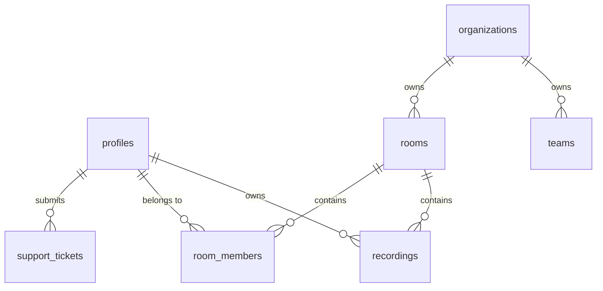

# Database Schema & Security

SpeakMirror uses **Supabase (PostgreSQL)** as its relational storage engine. Row-Level Security (RLS) is enabled on all tables to enforce access controls.

---

## 1. Entity Relationship Diagram

---

## 2. Core Tables

### `profiles`
Stores user profile information synced with Supabase Auth users.
- `id` (UUID, PK): References `auth.users.id`
- `display_name` (Text)
- `avatar_url` (Text)
- `primary_goal` (Text): Speaking objective
- `experience_level` (Text): "Beginner" | "Intermediate" | "Advanced"
- `onboarding_completed` (Boolean): Default `false`
- `streak_count` (Integer): Daily streak tracking
- `last_active` (Timestamp)

### `recordings`
Stores speech session metrics, confidence scores, and raw video storage paths.
- `id` (UUID, PK)
- `user_id` (UUID, FK): References `profiles.id`
- `room_id` (UUID, FK, Nullable): References `rooms.id`
- `topic` (Text)
- `video_url` (Text)
- `confidence` (Numeric)
- `clarity` (Numeric)
- `wpm` (Integer, Nullable)
- `filler_words` (Integer, Nullable)
- `transcript` (Text, Nullable)
- `eye_contact` (Numeric, Nullable)
- `expression_score` (Numeric, Nullable)
- `primary_emotion` (Text, Nullable)
- `coach_comment` (Text, Nullable)
- `annotations` (JSONB, Nullable)

### `organizations`
Multi-tenancy parent container for team workspaces.
- `id` (UUID, PK)
- `name` (Text)
- `subscription_tier` (Text): "FREE" | "PRO" | "TEAM"

### `rooms`
Collaboration workspaces where users share recording challenges.
- `id` (UUID, PK)
- `organization_id` (UUID, FK): References `organizations.id`
- `name` (Text)
- `invite_token` (Text, Unique)

### `room_members`
Junction table mapping users to rooms.
- `room_id` (UUID, PK, FK): References `rooms.id`
- `user_id` (UUID, PK, FK): References `profiles.id`
- `role` (Text): "MEMBER" | "ADMIN"

### `support_tickets`
Customer feedback and system tickets.
- `id` (UUID, PK)
- `user_id` (UUID, FK): References `profiles.id`
- `subject` (Text)
- `message` (Text)
- `status` (Text): "OPEN" | "CLOSED"

---

## 3. Row-Level Security (RLS)

Every table has RLS enabled by default to prevent cross-tenant exposure:

- **Profiles**: A profile row is readable by anyone, but writeable only by the user matching `auth.uid() = id`.
- **Recordings**: Writeable by the creator. Readable by the creator, or by members of the room that the recording is assigned to.
- **Rooms**: Readable and writeable by members listed in the `room_members` table for that room.
